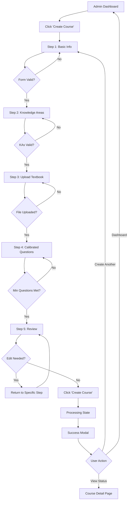

# LearnR Admin User Journey Flows

_Created on 2025-11-17_
_Admin-specific workflows for course management, analytics, and platform administration_

---

## Overview

Admin users have elevated permissions to manage the LearnR platform, including:
- **Course Management**: Create and edit courses via wizard experience
- **Global Analytics**: Track platform health (DAU, MAU, churn, concurrent users)
- **Subscription Metrics**: Monitor paid vs free user distribution
- **Content Evaluation**: Review user-generated feedback and reading content scores
- **Revenue Tracking**: Daily revenue monitoring and financial analytics

**Admin Access Control:**
- Admin users have a distinct role flag in the system
- Admin-only navigation items appear in side nav (learners don't see these)
- Admin routes protected by role-based access control (RBAC)

---

## Part B: Admin User Journeys

## Admin Journey 1: Course Creation Wizard

**Goal**: Create a new course with all required content and configuration

**Entry Point**: Admin clicks "Create Course" from admin dashboard

**Flow Stages**:

### Stage 1: Course Creation Wizard - Step 1 (Basic Information)

**Screen**: Wizard modal or full-page view (35px border radius main container)
**Progress Indicator**: "Step 1 of 5: Basic Information" (progress bar at top, pill-shaped)

**Form Fields**:
- **Course Name**: Text input (required)
  - Placeholder: "e.g., CBAP Certification Preparation"
  - Validation: 3-100 characters
- **Course Code**: Text input (required, unique)
  - Placeholder: "e.g., CBAP-2025"
  - Validation: Alphanumeric, 4-20 characters, must be unique
- **Course Description**: Textarea (required)
  - Placeholder: "Describe what learners will achieve..."
  - Validation: 50-500 characters
- **Exam Type**: Dropdown (required)
  - Options: "Certification Exam", "Professional Licensing", "Academic Assessment"
- **Target Audience**: Multi-select chips
  - Options: "Working Professionals", "Students", "Career Changers", "Enterprise Learners"

**Validation**:
- Real-time validation on blur
- Red error text below fields (vector icon: error_outline)
- Submit button disabled until all required fields valid

**Actions**:
- "Cancel" (secondary button, pill-shaped) → Confirmation modal: "Discard course creation?"
- "Next: Knowledge Areas" (primary button, pill-shaped) → Disabled until form valid

**Transition**: Slide to Step 2

---

### Stage 2: Course Creation Wizard - Step 2 (Knowledge Areas)

**Screen**: Wizard Step 2
**Progress Indicator**: "Step 2 of 5: Knowledge Areas" (40% progress)

**Content**:
- **Heading**: "Define Knowledge Areas"
- **Subheading**: "Knowledge areas are the domains covered in this course. Learners will see parallel progress across all areas."

**Knowledge Area Builder**:

**Dynamic List** (starts with 1 empty KA):
- Each KA has:
  - **KA Name**: Text input (required)
    - Placeholder: "e.g., Business Analysis Planning & Monitoring"
    - Validation: 5-100 characters
  - **KA Code**: Text input (required, unique within course)
    - Placeholder: "e.g., BA-PM"
    - Auto-suggest: Derived from name (e.g., "Business Analysis Planning" → "BA-PLAN")
  - **Weight %**: Number input (required)
    - Placeholder: "e.g., 16.7"
    - Validation: 0-100, sum of all KAs must equal 100%
  - **Description**: Textarea (optional)
    - Placeholder: "Brief description of this knowledge area..."
  - **Delete button**: Icon button (delete vector icon) - appears only if >1 KA exists

**Actions per KA**:
- Reorder: Drag handle icon (drag_indicator) to reorder KAs
- Delete: Trash icon button (delete) → Confirmation: "Remove this knowledge area?"

**Add Knowledge Area**:
- "+ Add Knowledge Area" button (secondary, pill-shaped)
- Maximum: 10 knowledge areas
- Validation: Shows warning if weights don't sum to 100%

**Validation Summary** (card at bottom, 14px border radius):
- Total weight: "95% (must equal 100%)" (red if invalid, green if valid)
- KA count: "5 knowledge areas defined"

**Actions**:
- "Back" (tertiary button) → Return to Step 1
- "Next: Textbook Upload" (primary button) → Disabled until validation passes

**Transition**: Slide to Step 3

---

### Stage 3: Course Creation Wizard - Step 3 (Textbook / Body of Knowledge)

**Screen**: Wizard Step 3
**Progress Indicator**: "Step 3 of 5: Source Material" (60% progress)

**Content**:
- **Heading**: "Upload Body of Knowledge"
- **Subheading**: "Upload the textbook or reference material. We'll chunk this content for targeted reading recommendations."

**Upload Section**:

**Option 1: File Upload**
- **Component**: File upload dropzone (large, 22px border radius)
- **Accepted formats**: PDF, DOCX, TXT, EPUB
- **Max size**: 50MB
- **UI**:
  - Drag-and-drop area with upload cloud icon (upload_file)
  - "Drag and drop your textbook here, or click to browse"
  - Shows file name, size, upload progress bar (pill-shaped) once selected
  - "Remove" button to clear selection

**Option 2: URL Input** (alternative)
- "Or provide a URL to online content"
- Text input for URL
- Validation: Must be valid URL format

**Processing Preview** (after upload):
- **Card** (14px border radius):
  - File name: "BABOK-Guide-v3.pdf"
  - Size: "4.2 MB"
  - Pages detected: "328 pages"
  - Status: "Ready to process" (checkmark icon)
  - "Change file" link (tertiary button style)

**Chunking Configuration** (expandable section):
- "Advanced: Chunking Settings" (accordion, collapsed by default)
- Expanded shows:
  - **Chunk size**: Slider (500-2000 tokens, default 1000)
  - **Overlap**: Slider (0-200 tokens, default 50)
  - **Strategy**: Radio buttons
    - "Semantic" (default): Chunks by topic/section
    - "Fixed": Chunks by character count
  - Help text: "Most courses work best with default settings"

**Actions**:
- "Back" (tertiary) → Return to Step 2
- "Next: Calibrated Questions" (primary) → Disabled until file uploaded or URL provided

**Transition**: Slide to Step 4

---

### Stage 4: Course Creation Wizard - Step 4 (Calibrated Questions)

**Screen**: Wizard Step 4
**Progress Indicator**: "Step 4 of 5: Calibrated Questions" (80% progress)

**Content**:
- **Heading**: "Add Calibrated Reference Questions"
- **Subheading**: "Upload or create reference questions. These calibrate the IRT model and serve as examples for LLM-generated questions."

**Upload Option**:
- **File upload**: CSV, JSON, or XLSX
- **Template download**: "Download question template" link (provides structured format)
- **Format**:
  ```csv
  question_text, option_a, option_b, option_c, option_d, correct_answer, difficulty, knowledge_area_code, explanation
  "Which technique...?", "Interviews", "Workshops", "Surveys", "Observation", "B", 0.6, "BA-PM", "Workshops facilitate..."
  ```

**Manual Entry Option**:
- "+ Add Question Manually" button (secondary, pill-shaped)
- Opens modal (22px border radius) with form:
  - **Question Text**: Textarea (required, 20-500 chars)
  - **Answer Options**: 4 text inputs (required, labeled A, B, C, D)
  - **Correct Answer**: Radio buttons (A, B, C, D)
  - **Difficulty**: Slider (0.0 to 1.0, default 0.5)
    - Labels: "Easy" (0.0), "Medium" (0.5), "Hard" (1.0)
  - **Knowledge Area**: Dropdown (populated from Step 2)
  - **Explanation**: Textarea (required, 50-300 chars)
    - Help: "Explain why the correct answer is right"
  - **Concept Tags**: Text input with chip creation
    - Placeholder: "Add tags... (e.g., requirements elicitation, stakeholder analysis)"
  - Actions: "Cancel" (secondary), "Add Question" (primary)

**Questions List** (scrollable, max-height with virtual scroll):
- Each question card (14px border radius):
  - **Question preview**: First 100 chars + "..." (if longer)
  - **Metadata badges**: KA code, difficulty (color-coded: green=easy, yellow=medium, red=hard)
  - **Actions**: Edit (icon button: edit), Delete (icon button: delete)

**Bulk Import Preview** (after file upload):
- **Table** (Material UI DataGrid):
  - Columns: Question (truncated), KA, Difficulty, Correct, Status
  - Status: Checkmark (valid) or warning icon (validation issues)
  - Pagination: 10 per page
  - Actions: "Edit" or "Remove" per row

**Validation**:
- Minimum questions required: 20 per knowledge area
- Shows warning card if insufficient: "⚠ BA-PM has only 12 questions (need 8 more)"
- Shows success card when sufficient: "✓ All knowledge areas have calibrated questions"

**Actions**:
- "Back" (tertiary) → Return to Step 3
- "Next: Review & Create" (primary) → Disabled until minimum questions met

**Transition**: Slide to Step 5

---

### Stage 5: Course Creation Wizard - Step 5 (Review & Create)

**Screen**: Wizard Step 5 (final review)
**Progress Indicator**: "Step 5 of 5: Review & Create" (100% progress)

**Content**:
- **Heading**: "Review Course Configuration"
- **Subheading**: "Verify all details before creating the course. You can edit everything later."

**Review Sections** (expandable accordions):

**1. Basic Information**
- Course Name: "CBAP Certification Preparation"
- Course Code: "CBAP-2025"
- Description: [Shows full description]
- Exam Type: "Certification Exam"
- Target Audience: Chips for each selected audience
- Action: "Edit" link → Returns to Step 1 with data preserved

**2. Knowledge Areas**
- Table:
  | KA Name | Code | Weight | Description |
  |---------|------|--------|-------------|
  | Business Analysis Planning... | BA-PM | 16.7% | [Description] |
  | Elicitation & Collaboration | ELICIT | 16.7% | [Description] |
  | ... | ... | ... | ... |
- Total weight: "100% ✓"
- Action: "Edit" → Returns to Step 2

**3. Source Material**
- File: "BABOK-Guide-v3.pdf"
- Size: "4.2 MB"
- Pages: "328 pages"
- Chunking strategy: "Semantic (1000 tokens, 50 overlap)"
- Action: "Edit" → Returns to Step 3

**4. Calibrated Questions**
- Total questions: "142"
- Breakdown by KA:
  - BA-PM: 24 questions ✓
  - ELICIT: 22 questions ✓
  - [All KAs listed with counts]
- Average difficulty: "0.52 (Medium)"
- Action: "Edit" → Returns to Step 4

**Processing Estimate** (info card, blue background):
- "Course creation will take approximately 10-15 minutes to process"
- Steps: "Upload content → Chunk text → Generate embeddings → Initialize IRT model"
- "You'll receive an email when processing is complete"

**Actions**:
- "Cancel Course Creation" (tertiary, left) → Confirmation modal
- "Create Course" (primary, right, pill-shaped) → Initiates course creation

**On Submit**:
- Loading state: Button shows spinner, text "Creating Course..."
- Success: Modal (22px border radius):
  - Celebration icon (stars burst vector)
  - "Course Created Successfully!"
  - "CBAP-2025 is now processing. You'll receive an email when it's ready for learners."
  - "View processing status" link → Navigate to course detail page
  - "Create Another Course" button (secondary)
  - "Return to Dashboard" button (primary)

**Transition**: Navigate to admin dashboard or course detail page

---

**Mermaid Diagram - Course Creation Flow**:



---

## Admin Journey 2: Global Analytics Dashboard

**Goal**: Monitor platform health and user engagement metrics

**Entry Point**: Admin clicks "Platform Analytics" from admin side navigation

**Flow Stages**:

### Main Analytics Dashboard

**Screen**: Full-page analytics dashboard (35px border radius main container)

**Layout**: Data-dense dashboard with multiple metric cards and charts

**Section 1: Key Performance Indicators (KPIs)** - Top row of metric cards

**Metric Cards** (22px border radius, arranged in 4-column grid on desktop):

**Card 1: Daily Active Users (DAU)**
- Large number: "1,247" (h2 size, bold)
- Trend indicator: "+12.3%" (green with up arrow) or "-5.2%" (red with down arrow)
- Sparkline chart: Last 7 days
- Comparison: "vs. yesterday: 1,113"

**Card 2: Monthly Active Users (MAU)**
- Large number: "8,942"
- Trend: "+18.7%" (vs. last month)
- Sparkline: Last 6 months
- Comparison: "vs. last month: 7,538"

**Card 3: Concurrent Users (Real-time)**
- Large number: "342" (updates every 10 seconds)
- Label: "Active right now"
- Icon: Live indicator dot (pulsing green)
- Peak today: "Peak: 489 (at 3:00 PM)"

**Card 4: User Churn Rate**
- Percentage: "4.2%"
- Trend: "-0.8%" (green, down arrow - lower churn is good)
- Period: "Last 30 days"
- Definition tooltip: "% users who didn't return within 30 days"

**Section 2: User Growth Chart** - Full-width chart

**Component**: Line chart (Chart.js or Recharts)
- **Time range selector**: Tabs (7d, 30d, 90d, 1y, All time)
- **X-axis**: Dates
- **Y-axis**: User count
- **Lines**:
  - New users (green)
  - Active users (blue)
  - Churned users (red)
- **Legend**: Below chart with color swatches
- **Tooltip**: On hover shows exact values for all lines at that date
- **Height**: 400px

**Section 3: User Segmentation** - 2-column grid

**Card 1: Paid vs Free Users** (Pie chart)
- **Donut chart**:
  - Paid subscribers: 2,341 (26.2%) - Green segment
  - Free users: 6,601 (73.8%) - Gray segment
- **Center text**: "8,942 Total Users"
- **Legend**: Below chart with exact numbers
- **Trend**: "Paid users +3.5% this month"

**Card 2: Subscription Tiers** (if multiple paid tiers)
- **Horizontal bar chart**:
  - Free: 6,601 users (73.8%)
  - Basic: 1,489 users (16.7%)
  - Pro: 723 users (8.1%)
  - Enterprise: 129 users (1.4%)
- **Revenue weight**: Shows which tier generates most revenue (not user count)

**Section 4: Engagement Metrics** - 3-column grid of cards

**Card 1: Average Session Duration**
- Time: "24 minutes 32 seconds"
- Trend: "+2 min 15 sec vs. last week"

**Card 2: Questions Answered per User**
- Average: "127 questions"
- Trend: "+15% vs. last month"

**Card 3: Course Completion Rate**
- Percentage: "34.2%"
- Definition: "% users who completed at least 1 mock exam"
- Trend: "+2.1% vs. last month"

**Section 5: Course Distribution** - Table

**Component**: Material UI DataGrid
- **Columns**: Course Name, Active Learners, Avg Progress, Completion Rate, Trend
- **Data**:
  | Course | Active Learners | Avg Progress | Completion | Trend |
  |--------|-----------------|--------------|------------|-------|
  | CBAP 2025 | 7,234 | 42% | 28% | +5.2% ↑ |
  | PSM1 | 1,421 | 38% | 31% | +2.1% ↑ |
  | CFA Level 1 | 287 | 29% | 15% | -1.3% ↓ |
- **Sorting**: Clickable column headers
- **Pagination**: 10 per page
- **Actions**: "View Details" link per row → Navigate to course-specific analytics

**Filters & Controls** (top of page, sticky):

**Date Range Picker**:
- Preset options: "Today", "Last 7 days", "Last 30 days", "Last 90 days", "Custom"
- Custom: Opens date range modal with calendar picker

**Export Options**:
- "Export Report" button (secondary, pill-shaped)
- Dropdown menu: "PDF Report", "CSV Data", "Excel Workbook"

**Refresh**:
- Auto-refresh toggle: "Auto-refresh every 30 seconds" (switch component)
- Manual refresh button (icon: refresh)

**Real-Time Updates**:
- Concurrent users updates every 10 seconds (shows loading pulse on card)
- Charts update when date range changes (skeleton loading state)

---

## Admin Journey 3: Revenue Tracking Dashboard

**Goal**: Monitor daily revenue and financial performance

**Entry Point**: Admin clicks "Revenue" from admin side navigation

**Flow Stages**:

### Revenue Analytics Screen

**Screen**: Revenue-focused dashboard (35px border radius main container)

**Section 1: Revenue KPIs** - Top row metric cards

**Card 1: Revenue Today**
- Amount: "$4,283.50"
- Trend: "+8.2% vs. yesterday ($3,962.00)"
- Sparkline: Last 7 days revenue

**Card 2: Revenue This Month**
- Amount: "$127,456.00"
- Trend: "+15.3% vs. last month ($110,523.00)"
- Days remaining: "18 days left in month"
- Projection: "Projected: $215,000"

**Card 3: Average Revenue Per User (ARPU)**
- Amount: "$14.26/month"
- Trend: "+$1.20 vs. last month"
- Breakdown tooltip: "Paid users only ARPU: $54.45"

**Card 4: Monthly Recurring Revenue (MRR)**
- Amount: "$127,456"
- Trend: "+$18,230 vs. last month"
- Churn-adjusted: "Net MRR: +$12,150 (after churn)"

**Section 2: Daily Revenue Chart** - Full-width line chart

**Component**: Line chart with area fill
- **X-axis**: Dates (last 90 days default)
- **Y-axis**: Revenue ($)
- **Line**: Daily revenue with green gradient fill below
- **Markers**: Significant events (e.g., marketing campaign launch, feature release)
- **Moving average**: 7-day MA line (dashed, lighter green)
- **Tooltip**: Shows exact revenue + number of transactions + ARPU for that day

**Section 3: Revenue Breakdown** - 2-column grid

**Card 1: Revenue by Subscription Tier** (Stacked bar chart)
- **Bars**: Monthly revenue stacked by tier
  - Basic tier (light green)
  - Pro tier (medium green)
  - Enterprise tier (dark green)
- **Legend**: Shows exact $ amount per tier
- **Y-axis**: Revenue ($)
- **X-axis**: Months

**Card 2: Revenue by Course** (Pie chart)
- **Segments**: Revenue attributed to each course
  - CBAP: $89,234 (70%)
  - PSM1: $28,456 (22%)
  - CFA: $9,766 (8%)
- **Center**: Total revenue this month
- **Click**: Drills down to course-specific revenue details

**Section 4: Transaction History** - Data table

**Component**: Material UI DataGrid with virtualization
- **Columns**: Date, User, Course, Tier, Amount, Payment Method, Status
- **Example row**:
  | Date | User | Course | Tier | Amount | Method | Status |
  |------|------|--------|------|--------|--------|--------|
  | Nov 17, 3:42 PM | user@email.com | CBAP | Pro | $49.99 | Stripe | Success ✓ |
- **Filters**:
  - Date range picker
  - Status filter: "All", "Success", "Failed", "Refunded"
  - Payment method filter: "All", "Stripe", "PayPal", "Other"
  - Amount range slider
- **Search**: Global search across user email, transaction ID
- **Actions**: "View Details" → Opens transaction detail modal
- **Pagination**: 25 per page
- **Export**: "Export Transactions" button → CSV or Excel

**Section 5: Financial Insights** - Cards with actionable insights

**Card 1: Failed Payments**
- Count: "12 failed payments today ($598.50 lost)"
- Action: "Contact users" button → Opens email template
- List: Shows recent failed payments with retry option

**Card 2: Churn Impact**
- Lost MRR: "-$6,080 from churned users this month"
- Affected users: "112 users churned"
- Breakdown by tier: "8 Pro ($4,800), 104 Basic ($1,280)"

**Card 3: Refund Requests**
- Pending: "3 refund requests pending review"
- Amount: "$149.97 total"
- Action: "Review Requests" → Navigate to refund management

**Filters & Export**:
- Date range selector (same as analytics dashboard)
- Currency selector (if multi-currency): "USD", "EUR", "GBP"
- Export options: PDF financial report, CSV data, Excel with charts

---

## Admin Journey 4: Course Editing

**Goal**: Edit existing course configuration and content

**Entry Point**: Admin clicks "Edit" on a course from course list

**Flow Stages**:

### Course Edit Interface

**Screen**: Course editor (similar to creation wizard but all steps accessible via tabs)

**Tab Navigation** (Material UI Tabs with green underline indicator):
- Basic Info
- Knowledge Areas
- Content Source
- Questions Bank
- Settings
- Danger Zone

**Tab 1: Basic Info**
- Same fields as creation wizard Step 1
- Additional fields:
  - **Status**: Toggle (Active / Inactive)
    - Inactive: Course hidden from learners, existing users retain access
  - **Visibility**: Dropdown (Public, Private, Unlisted)
  - **Featured**: Checkbox (show on homepage)
- "Save Changes" button (primary, pill-shaped) → Shows success toast on save

**Tab 2: Knowledge Areas**
- Same interface as creation wizard Step 2
- Additional features:
  - **Merge KAs**: Select 2+ KAs and merge into one (with confirmation)
  - **Split KA**: Divide one KA into multiple (opens wizard)
  - **Archive KA**: Soft delete (keeps historical data, hides from new content)
- Warning: "Editing KAs affects all existing learner progress. Proceed with caution."

**Tab 3: Content Source**
- Shows current textbook/body of knowledge
- **Replace content**: Upload new file
  - Warning modal: "Replacing content will re-chunk and re-embed. Existing reading recommendations may change. Continue?"
- **Add supplementary content**: Upload additional PDFs (appends, doesn't replace)
- **Chunking settings**: Edit chunk size, overlap (re-processes if changed)

**Tab 4: Questions Bank**
- **View all questions**: DataGrid with all calibrated questions
  - Columns: ID, Question (preview), KA, Difficulty, Usage Count, Last Used, Actions
  - Filters: KA, difficulty range, usage count
  - Bulk actions: Select multiple → Delete, Change KA, Adjust difficulty
- **Add new questions**: Opens manual entry modal or bulk upload
- **Edit question**: Click row → Opens edit modal with full question form
- **Question usage stats**: Shows how many times question was presented, accuracy rate
- **Import/Export**: "Export Questions" (CSV/JSON), "Import Questions" (with validation)

**Tab 5: Settings**
- **Diagnostic settings**:
  - Number of questions: Slider (10-30, default 20)
  - Time limit: Toggle (enabled/disabled), Number input (minutes)
- **Adaptive quiz settings**:
  - Questions per session: Slider (3-10, default 5)
  - Difficulty adjustment speed: Slider (conservative to aggressive)
  - Knowledge area targeting: Dropdown (weakest only, balanced, user choice)
- **Mock exam settings**:
  - Total questions: Number input (default 120)
  - Time limit: Number input (minutes, default 210)
  - Passing score: Number input (%, default 65)
- **Spaced repetition**:
  - SM-2 algorithm intervals: Edit 1, 3, 7, 14 day intervals
  - Review batch size: Number input (default 10)

**Tab 6: Danger Zone** (red accent)
- **Archive course**: Soft delete, keeps all data but hides from new enrollments
  - Button: "Archive Course" (destructive, pill-shaped)
  - Confirmation: Type course code to confirm
- **Delete course permanently**: Hard delete, removes all data including learner progress
  - Warning: "This action cannot be undone. All learner data will be lost."
  - Requires: Type "DELETE [course-code]" to confirm
  - Button: "Permanently Delete" (destructive)

**Save Behavior**:
- Auto-save: Changes save automatically after 2 seconds of inactivity
- Visual indicator: "Saving..." (with spinner) → "All changes saved ✓" (fades after 3 sec)
- Unsaved changes: If user navigates away, confirmation modal: "You have unsaved changes. Discard or save first?"

---

## Admin Journey 5: Course Evaluation & User Feedback

**Goal**: Review user-generated evaluations and content quality metrics

**Entry Point**: Admin clicks "Evaluations" from admin navigation

**Flow Stages**:

### Evaluation Dashboard

**Screen**: Evaluation monitoring dashboard (35px border radius)

**Section 1: Evaluation Overview** - Metric cards

**Card 1: Reading Content Scores**
- Average score: "4.2 / 5.0" (from user ratings)
- Total ratings: "8,423 ratings"
- Trend: "+0.3 vs. last month"

**Card 2: Question Quality**
- Average score: "4.5 / 5.0"
- Total ratings: "12,389 ratings"
- Flagged questions: "23 questions flagged for review"

**Card 3: Explanation Helpfulness**
- Average score: "4.1 / 5.0"
- Total ratings: "15,672 ratings"

**Card 4: Pending Reviews**
- Count: "47 evaluations need admin response"
- Oldest: "12 days old"

**Section 2: Reading Content Scores** - Detailed table

**Component**: DataGrid with expandable rows
- **Columns**: Content ID, Snippet (first 100 chars), KA, Avg Score, # Ratings, Flagged, Actions
- **Example row**:
  | ID | Content Snippet | KA | Score | Ratings | Flagged | Actions |
  |----|-----------------|----|----|---------|---------|---------|
  | RC-2341 | "Business analysis planning establishes..." | BA-PM | 3.8 | 45 | Yes (5) | View Details |

**Filters**:
- KA filter (multi-select)
- Score range slider (0-5)
- Flagged only toggle
- Min ratings count filter (hide low-sample-size content)

**Sort**: By score (asc/desc), rating count, flag count

**Row Expansion**: Click row to expand
- Shows full content text
- Individual ratings list (user, score, comment, date)
- Admin actions:
  - "Edit Content" → Opens content editor
  - "Mark for Revision" → Flags for content team
  - "Archive" → Removes from circulation

**Section 3: User Feedback Stream** - Chronological list

**Component**: Scrollable feed with infinite scroll
- Each feedback card (14px border radius):
  - **Header**: User email (masked: "user****@email.com"), Date/time, Course
  - **Type badge**: "Bug Report", "Feature Request", "Content Issue", "General Feedback"
  - **Content**: User's feedback text
  - **Attachments**: Screenshots (if any) - thumbnail with lightbox on click
  - **Rating**: Star rating (if applicable)
  - **Admin response section**:
    - If no response: "Respond" button (secondary) → Opens textarea
    - If responded: Shows admin response + timestamp + responder name
  - **Actions**:
    - "Mark as Resolved" (checkbox)
    - "Priority" dropdown (Low, Medium, High, Urgent)
    - "Assign to" dropdown (admin team members)
    - "Add internal note" (only visible to admins)

**Filters** (sidebar):
- Type: Multi-select (Bug, Feature, Content, General)
- Status: "Pending", "In Progress", "Resolved", "Archived"
- Priority: Multi-select
- Course: Multi-select
- Date range
- Has admin response: Yes/No toggle

**Bulk Actions**:
- Select multiple feedbacks
- Bulk operations: "Mark Resolved", "Set Priority", "Assign to", "Export"

**Section 4: Question Flags** - Table of flagged questions

**Component**: DataGrid
- **Columns**: Question ID, Question Text (preview), KA, Flag Reason, Flag Count, Actions
- **Flag reasons**:
  - "Incorrect answer" (most severe)
  - "Confusing wording"
  - "Outdated content"
  - "Duplicate question"
  - "Too easy/too hard"

**Actions per question**:
- "View Flags" → Opens modal showing all user reports with reasons
- "Edit Question" → Opens question editor
- "Dismiss Flags" → Mark as reviewed, flags cleared
- "Remove Question" → Soft delete from question bank

**Section 5: Analytics Insights** - Cards with actionable insights

**Card 1: Low-Performing Content**
- List: Top 10 lowest-rated content chunks
- Shows: Content snippet, score, rating count
- Action: "Bulk review" → Opens multi-edit interface

**Card 2: Most Helpful Content**
- List: Top 10 highest-rated content
- Shows: Content snippet, score, rating count
- Insight: "Analyze patterns to improve other content"

**Card 3: Trending Issues**
- Recent spike in specific feedback types
- Example: "15 users reported 'Strategy Analysis' content unclear (up 200% this week)"
- Action: "Investigate" → Filters feedback to that topic

**Export Options**:
- "Export Evaluations Report" (PDF summary with charts)
- "Export Raw Data" (CSV with all feedback and scores)
- "Export Flagged Questions" (CSV for review)

---

## Admin Navigation Structure

**Side Navigation for Admins** (in addition to learner nav items):

**Admin Section** (separator above, gray divider):
- Dashboard (admin home)
- Courses (icon: school)
  - All Courses
  - Create Course
- Analytics (icon: analytics)
  - Platform Metrics
  - Revenue
  - User Insights
- Evaluations (icon: rate_review)
  - Content Scores
  - User Feedback
  - Question Flags
- Users (icon: people)
  - User Management
  - Subscription Management
  - Support Tickets
- Settings (icon: settings)
  - Platform Settings
  - Email Templates
  - Payment Configuration

**Visual Indicator**:
- Admin nav items have subtle badge: "Admin" (small chip, gray background)
- Admin pages have distinct header color or top border (e.g., orange accent)

---

## Admin Component Specifications

### Course Creation Wizard Progress Bar

**Component**: Custom stepper (Material UI Stepper)
- **Layout**: Horizontal, top of wizard container
- **Steps**: 5 circles connected by lines
- **States**:
  - Completed: Green circle with checkmark icon (check_circle)
  - Current: Green circle with step number, pulsing animation
  - Upcoming: Gray circle with step number
- **Labels**: Below each circle, step name in small text
- **Line connector**: Solid green (completed), dashed gray (upcoming)

### Metric Card (KPI Card)

**Component**: Card with 22px border radius
- **Layout**:
  - Top: Label (14px, medium weight, gray)
  - Middle: Large metric value (32px, bold, primary text color)
  - Bottom left: Trend indicator (icon + percentage, color-coded)
  - Bottom right: Sparkline chart (optional, 60px width, 30px height)
- **Hover**: Subtle elevation increase (shadow)
- **Click** (if applicable): Expands to show detailed breakdown modal

### Data Export Modal

**Component**: Modal (22px border radius, 600px width)
- **Header**: "Export Data"
- **Body**:
  - **Format selector**: Radio buttons
    - PDF Report (with charts and summary)
    - CSV (raw data)
    - Excel Workbook (multiple sheets)
    - JSON (API-compatible)
  - **Date range**: Date range picker
  - **Filters**: Checkboxes for what to include (e.g., "Include user details", "Include revenue data")
  - **Preview**: Shows estimated file size and record count
- **Actions**: "Cancel" (secondary), "Export" (primary)
- **On export**: Progress bar while generating, then auto-download

---

## Admin Responsive Behavior

**Desktop (≥1280px):**
- Full admin dashboard with multi-column layouts
- Side nav always visible (240px width)
- Charts and tables at full size

**Tablet (768px - 1279px):**
- Admin side nav collapses to icons only (60px)
- Metric cards stack to 2 columns
- Tables remain full-width with horizontal scroll

**Mobile (<768px):**
- Admin functionality redirects to desktop with message:
  - "Admin features require desktop for optimal experience"
  - Or: Minimal mobile admin (only critical features like revenue overview)
- If mobile admin supported:
  - Bottom nav with Admin tab (opens admin menu)
  - Charts simplified to sparklines or summaries
  - Tables switch to card list view

---

## Accessibility (Admin-Specific)

**Data Tables**:
- Screen reader announces: "Table with X rows and Y columns"
- Row selection: "Press space to select row N"
- Sorting: "Column sortable, currently sorted ascending"

**Charts**:
- Alt text: "Line chart showing daily revenue from Nov 1 to Nov 17, ranging from $3,200 to $5,400"
- Data table alternative: "View data table" link below chart (screen reader accessible)

**Wizard Navigation**:
- ARIA live region announces step changes: "Now on step 2 of 5: Knowledge Areas"
- Keyboard: Arrow keys to navigate steps (if validation allows), Enter to proceed

**Color-Coded Trends**:
- Never rely on color alone
- Always include icon (arrow up/down) or text (+/-) alongside color

---

_This admin user journey documentation provides complete flow specifications for admin-specific features, enabling course management, analytics monitoring, and platform administration._
