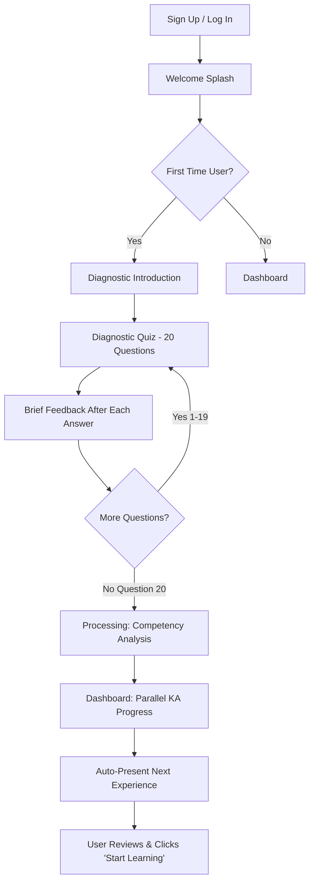
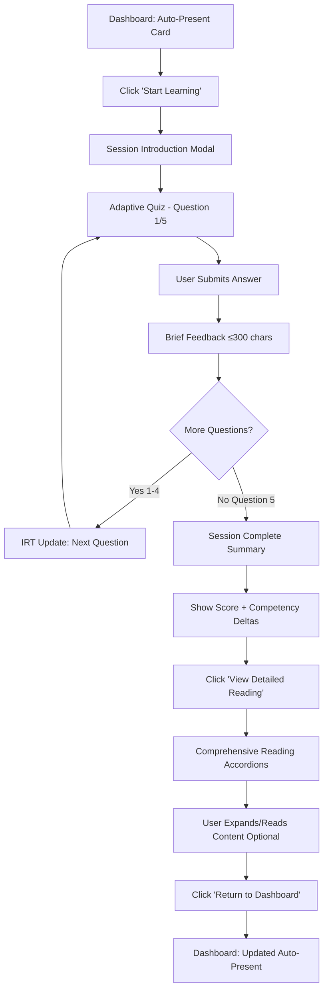
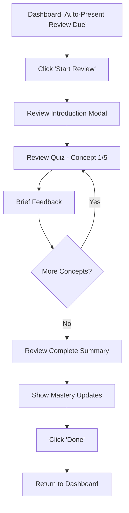
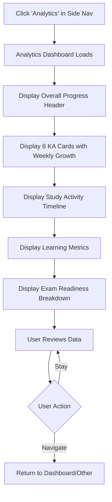
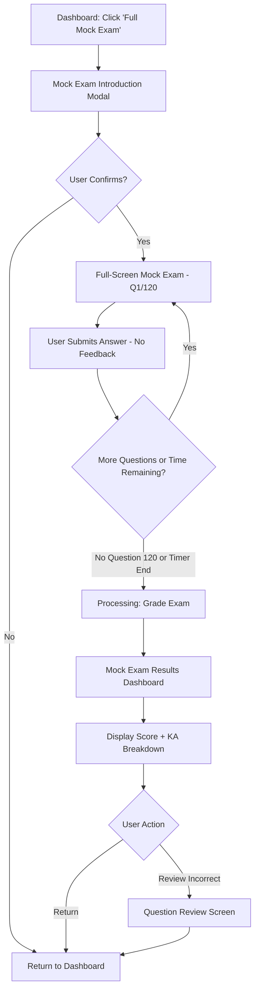

# LearnR User Journey Flows

_Created on 2025-11-17_
_Based on UX Design Direction Decisions and PRD Requirements_

---

## Overview

This document defines the critical user journeys for LearnR, incorporating:
- **Parallel KA Progression**: All 6 CBAP knowledge areas progress simultaneously
- **Auto-Present Logic**: System automatically determines next experience
- **Two-Stage Reading**: Brief explanations during quiz, comprehensive content after session
- **Side Navigation**: Easy access to dashboard and key actions
- **Material UI Components**: Professional, accessible design system

---

## Journey 1: First-Time User Onboarding

**Goal**: Establish user baseline competency and orient them to the platform

**Entry Point**: User signs up and logs in for the first time

**Flow Stages**:

### Stage 1: Welcome & Orientation
- **Screen**: Welcome splash
- **Content**:
  - "Welcome to LearnR - Your AI-Powered CBAP Preparation"
  - Brief explanation of adaptive learning approach (2-3 sentences)
  - CTA: "Start Diagnostic Test" button (primary green #CDF348)
- **User Action**: Click "Start Diagnostic Test"
- **Transition**: Slide to diagnostic introduction

### Stage 2: Diagnostic Introduction
- **Screen**: Diagnostic overview
- **Content**:
  - "Let's understand your current knowledge"
  - Explanation: "20-question diagnostic across all 6 CBAP knowledge areas"
  - Duration estimate: "~15 minutes"
  - No scoring/pressure messaging: "This helps us personalize your learning"
- **User Action**: Click "Begin Diagnostic"
- **Transition**: Enter quiz focus mode

### Stage 3: Diagnostic Quiz Session
- **Screen**: Quiz focus mode (approved design direction #3)
- **Layout**:
  - Top: Thin progress bar (1/20, 2/20... 20/20) - green #CDF348 fill
  - Center: Question card with 4 multiple-choice options
  - Bottom: "Submit Answer" button (disabled until selection)
- **Interaction Pattern**:
  1. User reads question
  2. User selects option (radio button style, green border on selection)
  3. User clicks "Submit Answer"
  4. **Brief Feedback** (≤300 chars):
     - Green checkmark or red X icon
     - "Correct!" or "Incorrect. The answer is [B]."
     - One-sentence explanation (max 300 chars)
     - CTA: "Next Question" button
  5. Repeat for all 20 questions
- **No Comprehensive Reading**: Diagnostic is uninterrupted, focused
- **Transition**: After question 20, fade to processing screen

### Stage 4: Competency Analysis
- **Screen**: Processing/loading state
- **Content**:
  - Animated spinner with green accent
  - "Analyzing your competency profile..."
  - Duration: ~1-2 seconds (IRT model computation)
- **Backend**: System calculates initial competency scores for all 6 KAs
- **Transition**: Reveal dashboard

### Stage 5: First Dashboard View
- **Screen**: Side navigation dashboard (approved design direction #4)
- **Layout**:
  - **Left Sidebar** (persistent):
    - Logo + "LearnR"
    - Nav items: Dashboard (active/green), Learn, Reviews, Mock Tests, Analytics, Profile
  - **Main Content Area**:
    - **Header**: "Your CBAP Competency Profile"
    - **Parallel KA Progress Visualization**:
      - Option A: 6 horizontal bars (one per KA) with competency percentage
      - Option B: Donut chart with 6 segments (each segment = 1 KA)
      - Colors: Green fill (#CDF348) for current level, gray for remaining
    - **Competency Scores** (beneath visualization):
      - Business Analysis Planning & Monitoring: 45%
      - Elicitation & Collaboration: 60%
      - Requirements Life Cycle Management: 50%
      - Strategy Analysis: 40%
      - Requirements Analysis & Design Definition: 55%
      - Solution Evaluation: 35%
    - **Auto-Present Next Experience**:
      - Card with green accent border
      - "Your Next Learning Session"
      - Description: "5 adaptive questions targeting Strategy Analysis"
      - CTA: "Start Learning" button (primary green)
    - **Action Buttons** (below):
      - "Take Diagnostic Test" (secondary button, outlined)
      - "Start Full Mock Exam" (secondary button, outlined)
- **User Action**: Reviews scores, clicks "Start Learning"
- **Transition**: Enter daily learning session

**Mermaid Diagram**:



---

## Journey 2: Daily Learning Session (Adaptive Quiz)

**Goal**: Present optimally-challenging questions to improve competency in targeted KAs

**Entry Point**: User clicks "Start Learning" from dashboard auto-present card

**Flow Stages**:

### Stage 1: Session Introduction
- **Screen**: Brief overlay modal
- **Content**:
  - "Adaptive Learning Session"
  - Target: "5 questions focusing on Strategy Analysis & Requirements Analysis"
  - Expected duration: "~8 minutes"
  - CTA: "Let's Go" button (green)
- **User Action**: Click "Let's Go"
- **Transition**: Enter quiz focus mode

### Stage 2: Adaptive Quiz Session
- **Screen**: Quiz focus mode (approved design direction #3)
- **Layout**: Same as diagnostic (progress bar, question card, submit button)
- **Adaptive Logic** (backend):
  - Question 1: Select from lowest-competency KA at user's estimated difficulty
  - After each answer: Update IRT competency estimate
  - Question 2-5: Select next question based on updated competency + gap match
- **Interaction Pattern**:
  1. User reads question
  2. User selects option
  3. User clicks "Submit Answer"
  4. **Brief Feedback Display** (≤300 chars):
     - Correct/Incorrect indicator
     - "The answer is [B]: [Brief one-sentence explanation]"
     - Max 300 characters total
     - CTA: "Continue" button (green)
  5. Click "Continue" → Next question
- **Key UX Decision**: No comprehensive reading content interrupts quiz flow
- **Transition**: After question 5, fade to session complete screen

### Stage 3: Session Complete Summary
- **Screen**: Session summary card (centered, modal style, 22px border radius)
- **Content**:
  - "Session Complete!" with celebration vector icon (party popper or stars burst)
  - Score: "4 out of 5 correct"
  - **Updated Competency Scores** (show deltas):
    - Strategy Analysis: 40% → 48% (+8%)
    - Requirements Analysis: 55% → 58% (+3%)
  - Daily Streak: "7 day streak!" with flame vector icon (Material Icons: local_fire_department)
  - CTA: "View Detailed Reading" button (primary green, pill-shaped)
- **User Action**: Clicks "View Detailed Reading"
- **Transition**: Navigate to reading content screen

### Stage 4: Comprehensive Reading Content
- **Screen**: Reading content view (full main area, side nav still present)
- **Layout**:
  - **Header**: "Recommended Reading - Strengthen Weak Areas"
  - **Subheader**: "Based on your performance in this session"
  - **Content**: Expandable accordion list (Material UI Accordion component)
    - Accordion items: Filtered to concepts from questions answered incorrectly
    - Example:
      - **Strategy Analysis: Business Case Development** (collapsed by default)
        - User clicks to expand
        - Displays: BABOK chunk (2-3 paragraphs) retrieved from vector DB
        - Includes: Key definitions, examples, best practices
      - **Requirements Analysis: User Stories vs Use Cases** (collapsed)
        - Expand to see detailed comparison content
  - **Bottom**: "Return to Dashboard" button (secondary)
- **User Action**:
  - Expands accordions to read content (optional)
  - Clicks "Return to Dashboard" when ready
- **Transition**: Return to dashboard with updated auto-present card

### Stage 5: Return to Dashboard
- **Screen**: Dashboard (side nav layout)
- **Updated Content**:
  - **Parallel KA Progress**: Visual bars/donut updated with new competency scores
  - **Auto-Present Next Experience**: System determines next action
    - Logic:
      - **If reviews due**: "You have 3 concepts ready for review" → "Start Review Session"
      - **If no reviews due**: "Continue learning Strategy Analysis" → "Start Learning"
    - CTA: Corresponding button (green)
- **User Action**: User can choose to start next experience or navigate elsewhere

**Mermaid Diagram**:



---

## Journey 3: Spaced Repetition Review Session

**Goal**: Reinforce previously learned concepts at optimal intervals for long-term retention

**Entry Point**: Dashboard auto-present shows "You have 5 concepts ready for review"

**Flow Stages**:

### Stage 1: Review Introduction
- **Screen**: Modal overlay
- **Content**:
  - "Review Session - Strengthen Your Memory"
  - Concepts due: "5 concepts across 3 knowledge areas"
  - Spaced repetition explanation: "Reviewing at the right time maximizes retention"
  - Expected duration: "~6 minutes"
  - CTA: "Start Review" button (green)
- **User Action**: Click "Start Review"
- **Transition**: Enter quiz focus mode

### Stage 2: Review Quiz Session
- **Screen**: Quiz focus mode (same as adaptive quiz)
- **Question Selection** (backend):
  - SM-2 algorithm: Retrieve concepts due for review (interval: 1, 3, 7, or 14 days)
  - Present questions tied to those concepts
  - Questions may be same or variations of previous questions
- **Interaction Pattern**: Same as adaptive quiz
  1. Question display
  2. User selects answer
  3. Submit → Brief feedback (≤300 chars)
  4. Continue → Next review question
- **Transition**: After all review questions, session complete screen

### Stage 3: Review Complete Summary
- **Screen**: Session summary (modal style)
- **Content**:
  - "Review Complete! 🧠"
  - Score: "5 out of 5 correct - Perfect review!"
  - **Mastery Updates**:
    - Strategy Analysis concepts: 2 concepts advanced to 7-day interval
    - Requirements Analysis concepts: 3 concepts advanced to 14-day interval
  - Next review: "3 concepts due tomorrow"
  - CTA: "Done" button (green)
- **User Action**: Click "Done"
- **Transition**: Return to dashboard

**Mermaid Diagram**:



---

## Journey 4: Progress Review & Analytics

**Goal**: Enable user to track progress, identify strengths/weaknesses, and plan study strategy

**Entry Point**: User clicks "Analytics" in side navigation

**Flow Stages**:

### Stage 1: Analytics Dashboard
- **Screen**: Data-dense dashboard (approved design direction #8, modified)
- **Layout** (main content area):

  **Section 1: Overall Progress Header**
  - Large heading: "Your CBAP Mastery Progress"
  - Daily streak: "12 days" with flame vector icon (Material Icons: local_fire_department) - prominent, top-right
  - Exam readiness: "68% - Approaching Ready" (progress bar with green fill, pill-shaped)

  **Section 2: Parallel KA Competency Scores** (primary visualization)
  - **6 Knowledge Area Cards** (2x3 grid):
    - Card 1: Business Analysis Planning & Monitoring
      - Current score: 72%
      - Weekly growth: +8% ↑ (green indicator)
      - Visual: Circular progress indicator (donut chart style)
    - Card 2: Elicitation & Collaboration
      - Current score: 68%
      - Weekly growth: +5% ↑
    - Card 3: Requirements Life Cycle Management
      - Current score: 65%
      - Weekly growth: +3% ↑
    - Card 4: Strategy Analysis
      - Current score: 58%
      - Weekly growth: +12% ↑ (highest growth - highlighted)
    - Card 5: Requirements Analysis & Design Definition
      - Current score: 70%
      - Weekly growth: +6% ↑
    - Card 6: Solution Evaluation
      - Current score: 55%
      - Weekly growth: +4% ↑

  **Section 3: Study Activity Timeline**
  - Line chart: Competency scores over time (past 4 weeks)
  - X-axis: Weeks
  - Y-axis: Competency %
  - 6 lines (one per KA) showing parallel progression

  **Section 4: Learning Metrics**
  - Total questions answered: 245
  - Overall accuracy: 76%
  - Concepts mastered: 42
  - Concepts in progress: 28
  - Review completion rate: 95%

  **Section 5: Exam Readiness Breakdown**
  - Table showing each KA readiness:
    | Knowledge Area | Current | Target | Status |
    |----------------|---------|--------|---------|
    | BA Planning    | 72%     | 75%    | Almost Ready ✓ |
    | Elicitation    | 68%     | 75%    | In Progress |
    | Requirements LC| 65%     | 75%    | In Progress |
    | Strategy       | 58%     | 75%    | Needs Focus |
    | Requirements AD| 70%     | 75%    | Almost Ready ✓ |
    | Solution Eval  | 55%     | 75%    | Needs Focus |

- **User Action**: Reviews analytics, scrolls through sections
- **Transition**: User navigates back to Dashboard or other section

**Mermaid Diagram**:



---

## Journey 5: Full Mock Exam Experience

**Goal**: Simulate real CBAP exam conditions and assess exam readiness

**Entry Point**: User clicks "Start Full Mock Exam" from dashboard action buttons

**Flow Stages**:

### Stage 1: Mock Exam Introduction
- **Screen**: Modal overlay with exam details
- **Content**:
  - "Full CBAP Mock Exam"
  - Question count: "120 questions"
  - Time limit: "3 hours 30 minutes"
  - Conditions: "No breaks, timer will run continuously"
  - Coverage: "All 6 knowledge areas (proportional to real exam)"
  - Warning: "This is a significant time commitment. Ensure you're ready."
  - CTAs:
    - "Start Mock Exam" button (green, primary)
    - "Cancel" button (secondary)
- **User Action**: Click "Start Mock Exam"
- **Transition**: Enter full-screen quiz mode

### Stage 2: Mock Exam Session
- **Screen**: Full-screen quiz focus mode (no side nav during exam)
- **Layout**:
  - **Top Bar**:
    - Timer (counting down from 3:30:00) - right side
    - Progress: "Question 15 of 120" - left side
    - "End Exam" button (secondary, confirmation required) - center-right
  - **Center**: Question card (same format as adaptive quiz)
  - **Bottom**: "Submit & Next" button
- **Interaction Pattern**:
  1. User reads question
  2. User selects answer
  3. User clicks "Submit & Next"
  4. **No feedback shown** (exam conditions)
  5. Immediately load next question
  6. Repeat for all 120 questions
- **Special Cases**:
  - User can click "End Exam" early (confirmation modal: "Are you sure? This will submit your exam.")
  - Timer reaches 0:00 → Auto-submit exam
- **Transition**: After question 120 or time expires, processing screen

### Stage 3: Exam Processing
- **Screen**: Processing/loading state
- **Content**:
  - "Grading your mock exam..."
  - Animated spinner (green accent)
  - Duration: ~2-3 seconds
- **Backend**: Calculate score, analyze performance by KA
- **Transition**: Reveal exam results

### Stage 4: Mock Exam Results
- **Screen**: Results dashboard (full main area)
- **Layout**:

  **Header Section**:
  - Large score: "82 out of 120 correct (68%)"
  - Pass/Fail indicator: "Pass - Above 65% threshold" (green checkmark)
  - Completion time: "3 hours 12 minutes"

  **Performance by Knowledge Area**:
  - Table breakdown:
    | KA | Questions | Correct | Score | Status |
    |----|-----------|---------|-------|--------|
    | BA Planning | 20 | 16 | 80% | Strong ✓ |
    | Elicitation | 20 | 14 | 70% | Good ✓ |
    | Requirements LC | 20 | 13 | 65% | Adequate |
    | Strategy | 20 | 11 | 55% | Needs Work |
    | Requirements AD | 20 | 15 | 75% | Good ✓ |
    | Solution Eval | 20 | 13 | 65% | Adequate |

  **Recommendations**:
  - "Focus on Strategy Analysis to improve exam readiness"
  - "Consider additional practice in Requirements Life Cycle Management"

  **Action Buttons**:
  - "Review Incorrect Questions" (primary green)
  - "Return to Dashboard" (secondary)

- **User Action**: Reviews results, clicks "Review Incorrect Questions" or "Return to Dashboard"
- **Transition**: Navigate to question review or dashboard

### Stage 5: Question Review (Optional)
- **Screen**: Scrollable list of incorrect questions
- **Layout**:
  - Each incorrect question displayed as card
  - Shows: Question text, user's answer (red), correct answer (green), detailed explanation
  - Allows user to review mistakes at own pace
- **User Action**: Scrolls through, clicks "Return to Dashboard" when done

**Mermaid Diagram**:



---

## Cross-Journey UX Patterns

### Auto-Present Logic Decision Tree

The system determines "next experience" based on the following priority:

```
1. IF (reviews_due > 0)
   THEN present "Review Session" with count

2. ELSE IF (mock_exam_not_taken OR days_since_mock > 14)
   THEN present "Full Mock Exam" recommendation

3. ELSE IF (lowest_KA_competency < 65%)
   THEN present "Adaptive Learning Session" targeting lowest KA

4. ELSE
   THEN present "Balanced Learning Session" across all KAs
```

### Brief Feedback Pattern (≤300 chars)

**Template**:
```
[Icon: Checkmark vector icon (correct) or X vector icon (incorrect) - Material Icons: check_circle or cancel]
[Result: "Correct!" or "Incorrect. The answer is [B]."]
[Explanation: One clear sentence explaining why. Max 150 chars.]
[CTA: "Continue" or "Next Question" button - pill-shaped, green]
```

**Example - Correct**:
```
[Checkmark Icon - Green] Correct!
Facilitated workshops are most effective for gathering diverse stakeholder input and achieving consensus on requirements.
[Continue - Pill Button]
```

**Example - Incorrect**:
```
[X Icon - Red] Incorrect. The answer is B.
While interviews are valuable, facilitated workshops bring stakeholders together to collaboratively define requirements in real-time.
[Continue - Pill Button]
```

### Parallel KA Progress Visualization

**Option A: Horizontal Bars** (Recommended for desktop)
```
Business Analysis Planning & Monitoring  ████████████░░░░░░░░ 72%
Elicitation & Collaboration              ████████████░░░░░░░░ 68%
Requirements Life Cycle Management       ███████████░░░░░░░░░ 65%
Strategy Analysis                        █████████░░░░░░░░░░░ 58%
Requirements Analysis & Design Def.      █████████████░░░░░░░ 70%
Solution Evaluation                      █████████░░░░░░░░░░░ 55%
```

**Option B: Donut Chart** (Recommended for mobile/compact view)
- Single donut chart with 6 colored segments
- Each segment represents one KA
- Segment size = competency level
- Green (#CDF348) for segments above 70%
- Yellow/orange for 60-69%
- Red for below 60%
- Center shows overall readiness %

### Navigation State Management

**Side Navigation Active States**:
- Active item: Green background (#CDF348), white text, bold
- Hover state: Light gray background
- Inactive: Default text color, no background

**Breadcrumb Pattern** (for deep navigation):
- Home > Analytics > Strategy Analysis Details
- Clickable links, separated by >
- Current page not clickable, different color

---

## Responsive Adaptations

### Mobile Modifications (≤768px)

1. **Side Navigation → Bottom Navigation** (approved direction #7)
   - 5 icons: Dashboard, Learn, Reviews, Profile, Menu
   - Active icon: Green fill
   - Fixed position at bottom of screen

2. **Parallel KA Progress**:
   - Switch from horizontal bars to donut chart (more compact)
   - KA details in expandable cards below chart

3. **Quiz Focus Mode**:
   - Maintain full-screen focus
   - Progress bar slightly thicker for touch visibility
   - Answer options: Full-width buttons with more padding

4. **Analytics Dashboard**:
   - Stack KA cards vertically (1 column instead of 2x3 grid)
   - Hide timeline chart by default (expandable section)

### Tablet Modifications (768px - 1024px)

1. **Side Navigation**: Keep side nav, reduce width to 60px (icons only)
   - Expand on hover to show labels

2. **Parallel KA Progress**: Use horizontal bars (sufficient space)

3. **Analytics Dashboard**: 2x3 grid maintained

---

## Accessibility Considerations

### Keyboard Navigation

- **Tab order**: Logical flow through all interactive elements
- **Focus indicators**: Green outline (#CDF348, 2px solid) on focused elements
- **Shortcuts**:
  - In quiz: Press 1-4 for answer options, Enter to submit
  - In dashboard: Tab to navigate, Enter to activate
  - Escape: Close modals/overlays

### Screen Reader Support

- **Progress indicators**: Announced as "Question 5 of 20, 25% complete"
- **Answer feedback**: "Correct answer" or "Incorrect answer, the correct answer is B"
- **KA scores**: "Business Analysis Planning and Monitoring, 72%, increased by 8% this week"
- **ARIA labels**: All interactive elements have clear labels

### Color Contrast

- Green (#CDF348) on white: 1.25:1 (insufficient for text)
  - Solution: Use green only for backgrounds/accents, not text
  - Text on green buttons: #212121 (dark gray) - 11.2:1 contrast
- Dark mode: White text (#FFFFFF) on dark gray (#1E1E1E): 14.8:1 contrast

---

## Implementation Notes

1. **State Management**: User progress, competency scores, and session state should persist across navigation
2. **Loading States**: All data fetches (questions, results, analytics) need loading indicators
3. **Error Handling**: Network failures, timeout scenarios should have retry options
4. **Session Persistence**: Mock exam should allow resuming if browser closes (save progress)
5. **Performance**: Quiz questions should prefetch next question during feedback display (perceived speed)

---

_This user journey documentation provides the complete flow specifications for development implementation, aligned with PRD requirements and approved UX design directions._
